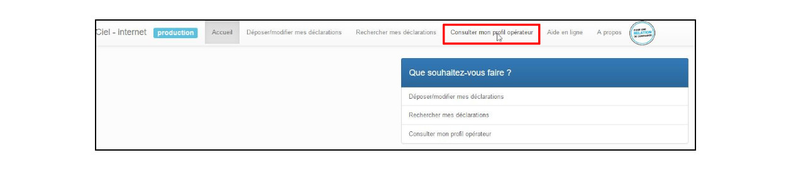
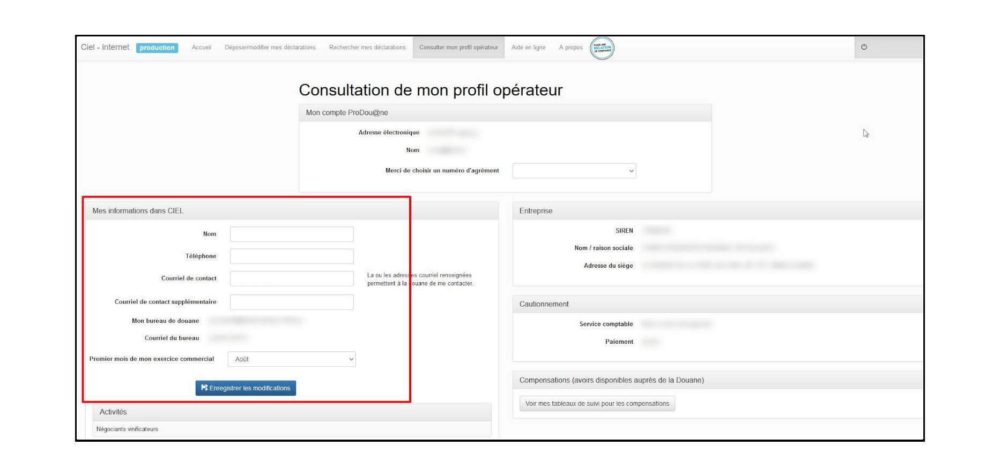
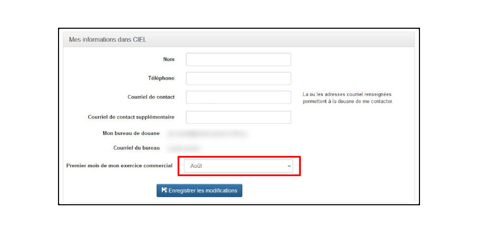

# DRM dounière : Changer le mois de démarrage de l'exercice commercial

Pour changer le mois de démarrage de l'exercice commercial, il faut se rendre dans CIEL et cliquer sur Consulter mon profil opérateur :

Dans ce profil, il existe une section 'Mes informations dans CIEL' :

Il est possible dans cette section de modifier le mois de démarrage :

