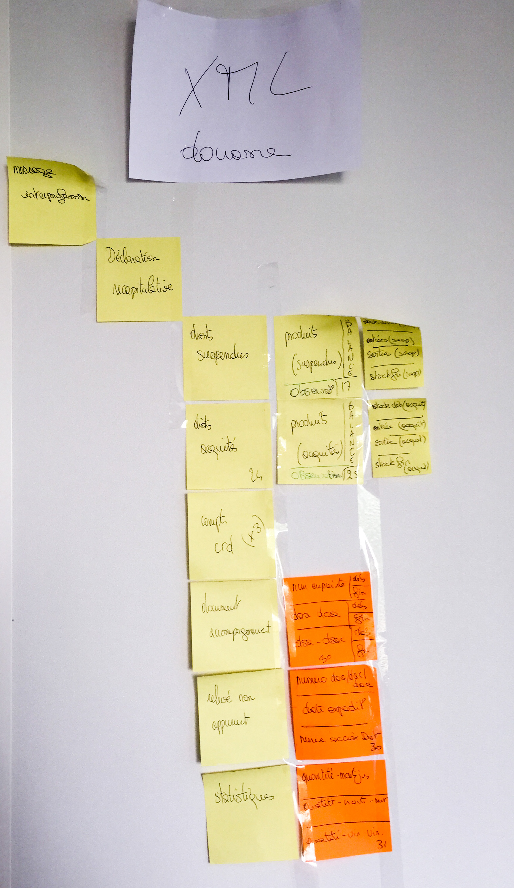

Structure XML de la DRM des douanes
===================================

[Consulter le contrat de service (en changeant de branch, il est possible d'y accéder avec différentes version]][contrat_de_service_interpro.md]

Exemples : 

 - de [DRM XML](drm.xml)
 - de [retour fructueux](retour_success.xml)
 - de [retour d'erreurs documentées](retour_error1.xml)
 - de [retour d'erreur non documentée](retour_error2.xml)

[Arborescence complète (format text/plain)](https://github.com/24eme/mutualisation-douane/blob/master/xml/drm/arbo.md)

Representation graphique du XML Douane (1.6) :
-------------

Récapitulatif :

 - 

Produits suspendus :

 - 

Produits acquités :

 - 

Comptes CRD :

 - 

